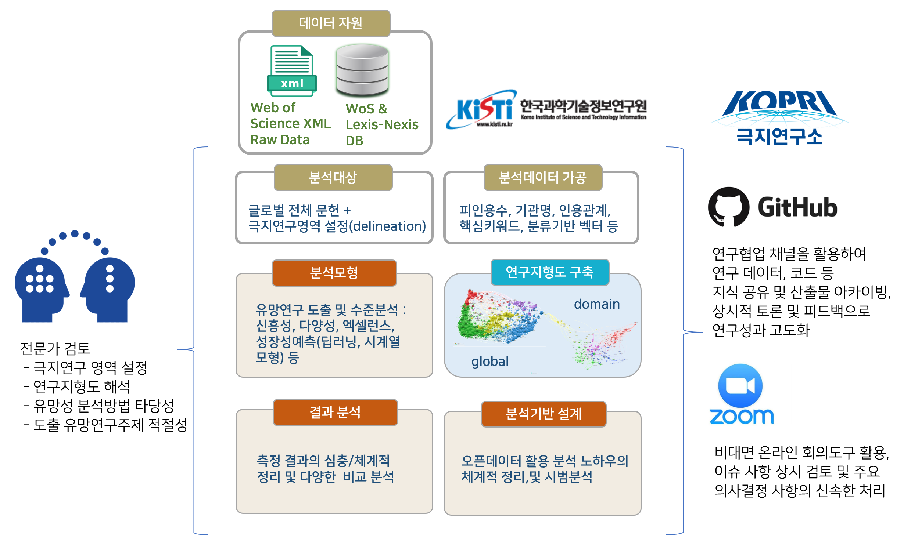

# 소개 {-}

이 문서는 **극지연구 성과 분석 및 미래 극지연구 도출** 과제를 수행하며 주요 단계별로 수행한 작업내용을 정리하고 공유하기 위해 작성하였습니다. 

현재 진행 중에 있으며, 완료되기 전까지 내용이 수시로 갱신될 것입니다. 

작업에 대한 최종 출판물(보고서, 논문 등)의 발간 이전까지는 이곳에 작성된 내용은 열람만 가능하며, 어떤 형태로도 이용을 해서는 안됩니다. 인용도 금지합니다.

하지만 작업에 대한 질문이나 제언은 언제든 환영하고, 아래 참여 연구원 메일을 이용하시면 되겠습니다. (이 문서에서 댓글이 가능하도록 작업중입니다.) 

과제의 구성도는 아래 그림과 같습니다. 

(ref:research-frame) **극지연구 성과 분석 및 미래 극지연구 도출** 과제의 전체 구성도 

(\#fig:research-frame)(ref:research-frame)

## 과제 참여 연구원 {-}

* [이준영](road2you@kisti.re.kr) (과제책임)
* [고병열](cohby@kisti.re.kr)
* [박진서](jayoujin@kisti.re.kr)
* [손은수](essohn@kisti.re.kr)
* [안세정](sjahn@kisti.re.kr)
* [하태현](taehyunha@kisti.re.kr)

